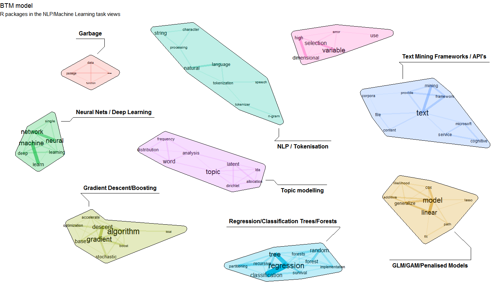

# BTM - Biterm Topic Modelling for Short Text with R

This is an R package wrapping the C++ code available at https://github.com/xiaohuiyan/BTM for constructing a **Biterm Topic Model (BTM)**. This model models word-word co-occurrences patterns (e.g., biterms). 

> Topic modelling using biterms is particularly good for finding topics in short texts (as occurs in short survey answers or twitter data).

### Installation

This R package is on CRAN, just install it with `install.packages('BTM')`

### What

The Biterm Topic Model (BTM) is a word co-occurrence based topic model that learns topics by modeling word-word co-occurrences patterns (e.g., biterms)

- A biterm consists of two words co-occurring in the same context, for example, in the same short text window. 
- BTM models the biterm occurrences in a corpus (unlike LDA models which model the word occurrences in a document). 
- It's a generative model. In the generation procedure, a biterm is generated by drawing two words independently from a same topic `z`. In other words, the distribution of a biterm `b=(wi,wj)` is defined as: `P(b) = sum_k{P(wi|z)*P(wj|z)*P(z)}` where k is the number of topics you want to extract.
- Estimation of the topic model is done with the Gibbs sampling algorithm. Where estimates are provided for `P(w|k)=phi` and `P(z)=theta`.

More detail can be referred to the following paper:

> Xiaohui Yan, Jiafeng Guo, Yanyan Lan, Xueqi Cheng. A Biterm Topic Model For Short Text. WWW2013.
> https://github.com/xiaohuiyan/xiaohuiyan.github.io/blob/master/paper/BTM-WWW13.pdf





### Example

```
library(udpipe)
library(BTM)
data("brussels_reviews_anno", package = "udpipe")

## Taking only nouns of Dutch data
x <- subset(brussels_reviews_anno, language == "nl")
x <- subset(x, xpos %in% c("NN", "NNP", "NNS"))
x <- x[, c("doc_id", "lemma")]

## Building the model
set.seed(321)
model  <- BTM(x, k = 3, beta = 0.01, iter = 1000, trace = 100)

## Inspect the model - topic frequency + conditional term probabilities
model$theta
[1] 0.3406998 0.2413721 0.4179281

topicterms <- terms(model, top_n = 10)
topicterms
[[1]]
         token probability
1  appartement  0.06168297
2      brussel  0.04057012
3        kamer  0.02372442
4      centrum  0.01550855
5      locatie  0.01547671
6         stad  0.01229227
7        buurt  0.01181460
8     verblijf  0.01155985
9         huis  0.01111402
10         dag  0.01041345

[[2]]
         token probability
1  appartement  0.05687312
2      brussel  0.01888307
3        buurt  0.01883812
4        kamer  0.01465696
5     verblijf  0.01339812
6     badkamer  0.01285862
7   slaapkamer  0.01276870
8          dag  0.01213928
9          bed  0.01195945
10        raam  0.01164474

[[3]]
         token probability
1  appartement 0.061804812
2      brussel 0.035873377
3      centrum 0.022193831
4         huis 0.020091282
5        buurt 0.019935537
6     verblijf 0.018611710
7     aanrader 0.014614272
8        kamer 0.011447470
9      locatie 0.010902365
10      keuken 0.009448751
scores <- predict(model, newdata = x)
```

**Make a specific topic called the background**

```
# If you set background to TRUE
# The first topic is set to a background topic that equals to the empirical word distribution. 
# This can be used to filter out common words.
set.seed(321)
model      <- BTM(x, k = 5, beta = 0.01, background = TRUE, iter = 1000, trace = 100)
topicterms <- terms(model, top_n = 5)
topicterms
```

### Visualisation of your model

- Can be done using the textplot package (https://github.com/bnosac/textplot), which can be found at CRAN as well (https://cran.r-project.org/package=textplot) 
- An example visualisation built on a model of all R packages from the Natural Language Processing and Machine Learning task views is shown above (see also https://www.bnosac.be/index.php/blog/98-biterm-topic-modelling-for-short-texts)

```
library(textplot)
library(ggraph)
library(concaveman)
plot(model)
```

### Provide your own set of biterms

An interesting use case of this package is to 

- cluster based on parts of speech tags like nouns and adjectives which can be found in the text in the neighbourhood of one another
- cluster dependency relationships provided by NLP tools like udpipe (https://CRAN.R-project.org/package=udpipe)

This can be done by providing your own set of biterms to cluster upon. 

**Example clustering cooccurrences of nouns/adjectives**

```
library(data.table)
library(udpipe)
## Annotate text with parts of speech tags
data("brussels_reviews", package = "udpipe")
anno <- subset(brussels_reviews, language %in% "nl")
anno <- data.frame(doc_id = anno$id, text = anno$feedback, stringsAsFactors = FALSE)
anno <- udpipe(anno, "dutch", trace = 10)

## Get cooccurrences of nouns / adjectives and proper nouns
biterms <- as.data.table(anno)
biterms <- biterms[, cooccurrence(x = lemma, 
                                  relevant = upos %in% c("NOUN", "PROPN", "ADJ"),
                                  skipgram = 2), 
                   by = list(doc_id)]
                   
## Build the model
set.seed(123456)
x     <- subset(anno, upos %in% c("NOUN", "PROPN", "ADJ"))
x     <- x[, c("doc_id", "lemma")]
model <- BTM(x, k = 5, beta = 0.01, iter = 2000, background = TRUE, 
             biterms = biterms, trace = 100)
topicterms <- terms(model, top_n = 5)
topicterms
```

**Example clustering dependency relationships**

```
library(udpipe)
library(tm)
library(data.table)
data("brussels_reviews", package = "udpipe")
exclude <- stopwords("nl")

## Do annotation on Dutch text
anno <- subset(brussels_reviews, language %in% "nl")
anno <- data.frame(doc_id = anno$id, text = anno$feedback, stringsAsFactors = FALSE)
anno <- udpipe(anno, "dutch", trace = 10)
anno <- setDT(anno)
anno <- merge(anno, anno, 
              by.x = c("doc_id", "paragraph_id", "sentence_id", "head_token_id"), 
              by.y = c("doc_id", "paragraph_id", "sentence_id", "token_id"), 
              all.x = TRUE, all.y = FALSE, suffixes = c("", "_parent"), sort = FALSE)

## Specify a set of relationships you are interested in (e.g. objects of a verb)
anno$relevant <- anno$dep_rel %in% c("obj") & !is.na(anno$lemma_parent)
biterms <- subset(anno, relevant == TRUE)
biterms <- data.frame(doc_id = biterms$doc_id, 
                      term1 = biterms$lemma, 
                      term2 = biterms$lemma_parent,
                      cooc = 1, 
                      stringsAsFactors = FALSE)
biterms <- subset(biterms, !term1 %in% exclude & !term2 %in% exclude)

## Put in x only terms whch were used in the biterms object such that frequency stats of terms can be computed in BTM
anno <- anno[, keep := relevant | (token_id %in% head_token_id[relevant == TRUE]), by = list(doc_id, paragraph_id, sentence_id)]
x    <- subset(anno, keep == TRUE, select = c("doc_id", "lemma"))
x    <- subset(x, !lemma %in% exclude)

## Build the topic model
model <- BTM(data = x, 
             biterms = biterms, 
             k = 6, iter = 2000, background = FALSE, trace = 100)
topicterms <- terms(model, top_n = 5)
topicterms
```


## Support in text mining

Need support in text mining?
Contact BNOSAC: http://www.bnosac.be

